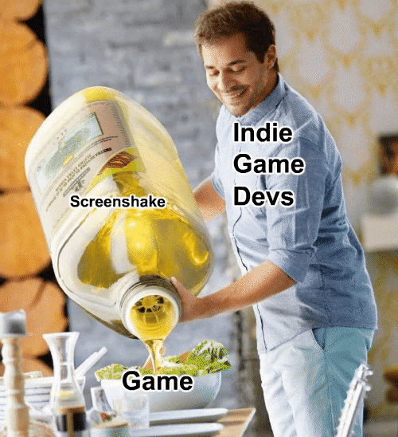
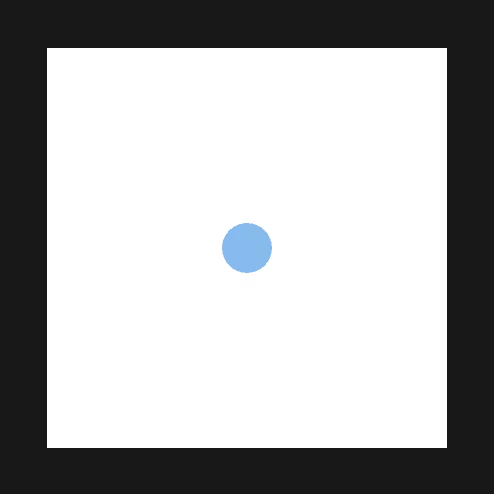
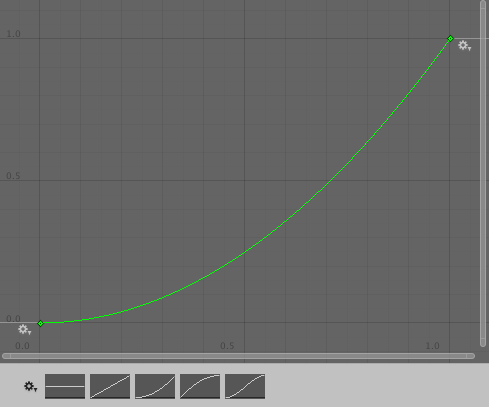
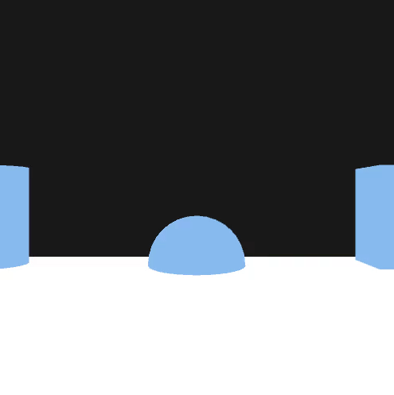
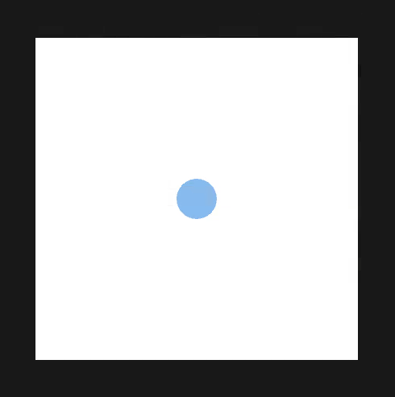
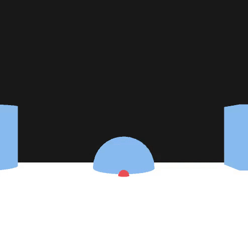
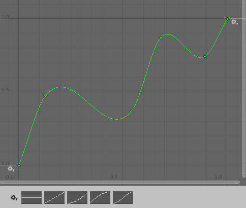

# All purpose screenshake, the right way

> Trauma is everything 👌

* * *

## Intro

Over the years, you most likely encountered many forms of **screenshakes**, whether they were a way to *increase the impact* of the player's actions or those of *the enemies*.  
This tutorial will focus on the later since this series is all about **getting your ass kicked**.

This tutorial was heavily based on [this GDC talk](https://www.youtube.com/watch?v=tu-Qe66AvtY) with improvements here and there.
The implementation is done in **Unity** but can easily be ported to any other engine.

## Screenshake, the usual way


> Lunch at Vlambeer (Artist impression)

For a lot of games, screenshakes seem to work this way :
* Player gets hit
* Pick a random 2d direction
* Move the camera using this direction

Some do add a certain *continuity* and *smoothness* in the movement by **interpolating** the last frame's position with the new one while other also add *time based* power reduction, there is a lot that could be added to this in order to make it *feel better* and easier to use but what if we took a step back and **try a different approach**?

*Note : We will be focusing on "random" screenshakes for now, and will discuss directional screenshakes later on.*

## Screenshake, the better way

### Traumatising

This idea behind **trauma based** screenshake is fairly simple: 
A *variable* is used to describe the *current* trauma of the player, this variable is normalized from 0 to 1.  
Every time the player *gets hit*, this variable go up from a certain number depending on the *power* of the attack.  
The value of the variable **carry on** from frame to frame but *decreases* with time.  
This variable can then be used in order to move the camera just like the usual way.  

⠀



⠀

In addition to a nice *time based reduction* this give us a really more interesting thing : **additivity**.  
In other words, a lot of *small hits* could create *big screenshakes* if received in a small time window.

⠀

```c#
void LateUpdate()
{
    transform.localPosition  = new Vector3(
        maxTranslation.x * trauma * Random.Range(-1f, 1f),
        maxTranslation.y * trauma * Random.Range(-1f, 1f),
        0
    );

    trauma = Mathf.Max(0, trauma - traumaReduction * Time.deltaTime);
}
```

⠀

### Of linearity

Linearity doesn't feel natural for a lot of things, sounds does not *scale linearly*, being good at making games does not scale linearly, the way things *hurt* does not either.  
As you can probably guess, same goes for screenshakes!  
In his GDC talk, *Squirrel Eiserloh* uses a **power** function for this purpose, it works great but is quite difficult to use when you want to do fine-tuning.  
A more user-friendly approach would be to use **curves** as they give designers *quick* and *powerful* controls on how two values relate to each other.  

⠀


> A beautiful curve that is **definitely** not doable with a power function

⠀

```c#
void LateUpdate()
{
🦑  float shake = traumaCurve.Evaluate(trauma);

    transform.localPosition  = new Vector3(
        maxTranslation.x * **shake** * Random.Range(-1f, 1f),
        maxTranslation.y * **shake** * Random.Range(-1f, 1f),
        0
    );

    trauma = Mathf.Max(0, trauma - traumaReduction * Time.deltaTime);
}
```

⠀

### Axis of liberty

For a long time, games have been *two-dimensional* since then games have evolved, many screenshakes did not.  
Cameras are now able to **rotate** and we will take advantage of that (even in 2d games)!  

This is where we start making a difference between screenshakes in *2d* and *3d* games, in this context 2d or 3d are not used to describe the way the game is rendered but the way the *camera relate to the player*: **first** and **third** person camera are 3d when **side** and **bird's eye view** are 2d.  

*Note : This is also a matter of perspective as the bigger perspective the fewer objects will be moving when using translational shake.*  

For 2d games, things are pretty straightfoward: just add a *rotation* to the camera using the *trauma value*, it will feel a w e s o m e.  

⠀


⠀

However, 3d games actually **do not** do well with *translation* as it can lead to the camera *traversing walls* and using the **3 axis** of *rotation* is best the way to go here.  

⠀



⠀

```c#
void LateUpdate()
{
    float shake = traumaCurve.Evaluate(trauma);

    transform.localPosition  = new Vector3(
        maxTranslation.x * shake * Random.Range(-1f, 1f),
        maxTranslation.y * shake * Random.Range(-1f, 1f),
        0
    );

🦑  transform.localEulerAngles = new Vector3(
🦑         maxAngle.x * shake * Random.Range(-1f, 1f),
🦑         maxAngle.y * shake * Random.Range(-1f, 1f),
🦑         maxAngle.z * shake * Random.Range(-1f, 1f)
🦑  );

    trauma = Mathf.Max(0, trauma - traumaReduction * Time.deltaTime);
}
```

⠀

### Space-Time continuity

For now, we only used a **random** function in order to get our *translation* or *rotation* value.  
This works but has two major flaws:
* No *continuity* of the transformation
* Lack of time *scaling*

Those two flaws can easily be fixed by using *perlin noise* instead as two close positions in a perlin noise will have two similar values.

>Perlin noise takes 2 values as input, what do we do?

We will want to use a *random number* that will be hardcoded and different for each of the *transformations fields* and use the **time** as the second value.

⠀



>Are those *actually* slowed down gifs?

⠀

```c#
void LateUpdate()
{
    float shake = traumaCurve.Evaluate(trauma);
    
    transform.localEulerAngles = new Vector3(
🦑      maxAngle.x * shake * (Mathf.PerlinNoise(42314.1534f, Time.time) * 2 - 1),
🦑      maxAngle.y * shake * (Mathf.PerlinNoise(56291.2783f, Time.time) * 2 - 1),
🦑      maxAngle.z * shake * (Mathf.PerlinNoise(16912.2456f, Time.time) * 2 - 1)
    );

    transform.localPosition  = new Vector3(
🦑      maxTranslation.x * shake * (Mathf.PerlinNoise(78312.75412f, Time.time) * 2 - 1),
🦑      maxTranslation.y * shake * (Mathf.PerlinNoise(13781.45754f, Time.time) * 2 - 1),
        0
    );

    trauma = Mathf.Max(0, trauma - traumaReduction * Time.deltaTime);
}
```

⠀

## Going further

Until now the **trauma reduction** over time was always the same.  
However, like many things in life, it can *improve* a lot by using a **curve** to model it.  
For example the **trauma** could be reduced *more* or *less* depending on it's own value.

⠀


>A very well designed trauma reduction curve

⠀

```c#
void LateUpdate()
{
    float shake = traumaCurve.Evaluate(trauma);
    
    transform.localEulerAngles = new Vector3(
        maxAngle.x * shake * (Mathf.PerlinNoise(42314.1534f, Time.time) * 2 - 1),
        maxAngle.y * shake * (Mathf.PerlinNoise(56291.2783f, Time.time) * 2 - 1),
        maxAngle.z * shake * (Mathf.PerlinNoise(16912.2456f, Time.time) * 2 - 1)
    );

    transform.localPosition  = new Vector3(
        maxTranslation.x * shake * (Mathf.PerlinNoise(78312.75412f, Time.time) * 2 - 1),
        maxTranslation.y * shake * (Mathf.PerlinNoise(13781.45754f, Time.time) * 2 - 1),
        0
    );

🦑  float reduction = traumaReduction * traumaReductionCurve.Evaluate(trauma);
🦑  trauma = Mathf.Max(0, trauma - reduction * Time.deltaTime);
}
```

⠀

Sometimes you will want to tweak the **speed** of the shakes, this is exactly the same as *multiplying* perlin noise's **frequency**!

⠀


>Perlin noise at different frequencies

⠀

```c#
void LateUpdate()
{
    float shake = traumaCurve.Evaluate(trauma);
    
    transform.localEulerAngles = new Vector3(
🦑      maxAngle.x * shake * (Mathf.PerlinNoise(42314.1534f, Time.time * timeMultiplier) * 2 - 1),
🦑      maxAngle.y * shake * (Mathf.PerlinNoise(56291.2783f, Time.time * timeMultiplier) * 2 - 1),
🦑      maxAngle.z * shake * (Mathf.PerlinNoise(16912.2456f, Time.time * timeMultiplier) * 2 - 1)
    );

    transform.localPosition  = new Vector3(
🦑      maxTranslation.x * shake * (Mathf.PerlinNoise(78312.75412f, Time.time * timeMultiplier) * 2 - 1),
🦑      maxTranslation.y * shake * (Mathf.PerlinNoise(13781.45754f, Time.time * timeMultiplier) * 2 - 1),
        0
    );

    float reduction = traumaReduction * traumaReductionCurve.Evaluate(trauma);
    trauma = Mathf.Max(0, trauma - reduction * Time.deltaTime);
}
```

⠀

**That's it for now**!

If you have any *improvement idea* or *question* related to this tutorial feel free to hit me at [@screenshakes](https://twitter.com/screenshakes)  
For further *updates* and *tutorials*, you can follow us on Twitter [@borderline_vg](https://twitter.com/borderline_vg)

You can also **download** the final Unity package [here](../../sources/GettingHit!-TraumaScreenshake.unitypackage).

* * *

[back](./)
